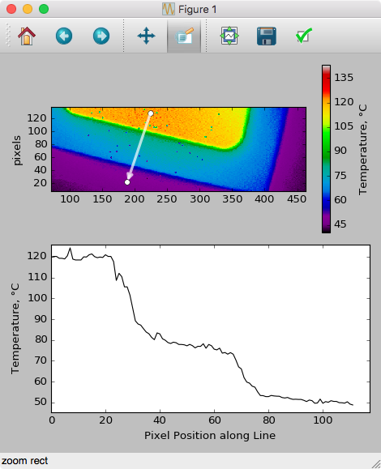

# README #

## Project Purpose ##

Intended for 2D Temperature data exported from the [QFI Infrared Thermal Microscope](https://signupmonkey.ece.ucsb.edu/wiki/index.php/IR_Thermal_Microscope_(QFI)), 
this Module lets users import the 2D thermal data, and then drag a line on a pcolormesh plot & plot the data values along that line on a separate axis.

See `help(QFIScope.Plot)` for examples on usage.

## Getting Data Files ##

From the QFI "ThermalMap" software, after acquiring a ThermalMap image, go to 

    File > Save Text...

to save a text file of the raw thermal data.  This is the data file you'll load with the Python script.

and optionally also do

    File > Save Image...
    
to save the image itself, which should look identical to the plot you obtain when running the pythong script.  Saving a screenshot of the entire measurement is also a good idea, since that'll show you the sensitivity and scale bars as well.

## Python Examples ##

The following script pops up a plot of the thermal image, with interactive dragging to show a line-slice along the dragged line:

```
#!python

import QFIScope as qfi     # module for QFI Thermal Imaging Microscope data analysis

DataFilePath = '2016-03-02 - QFI thermal image data - 1.5mA med temp.txt'

qfi.Plot(DataFilePath, LineSlicePlot=True)
```

The resulting interactive plot, with data plotted along the dragged line:



`qfi.Plot(DataFilePath, LineSlicePlot=True, hold=True)` allows you to drag multiple lines and overlay multiple thermal profiles.


## Authors ##
Created by Demis D. John, University of California Santa Barbara

For analyzing thermal data from the [QFI Infrared Thermal Microscope](https://signupmonkey.ece.ucsb.edu/wiki/index.php/IR_Thermal_Microscope_(QFI)) at the [UCSB Nanofab](http://nanotech.ucsb.edu).

Feel free to fork this repo, add functionality, and submit a pull request to incorporate your updates.
